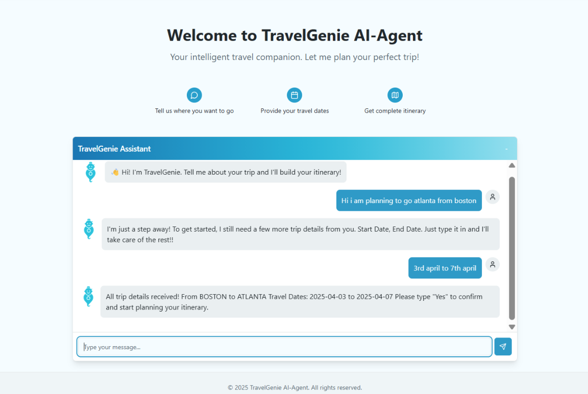
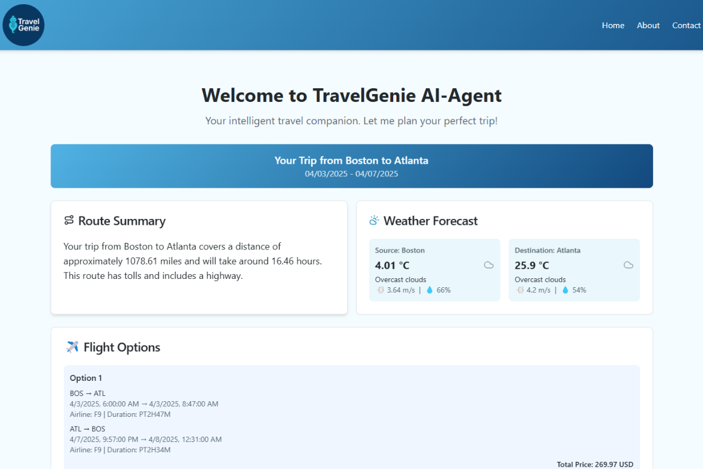
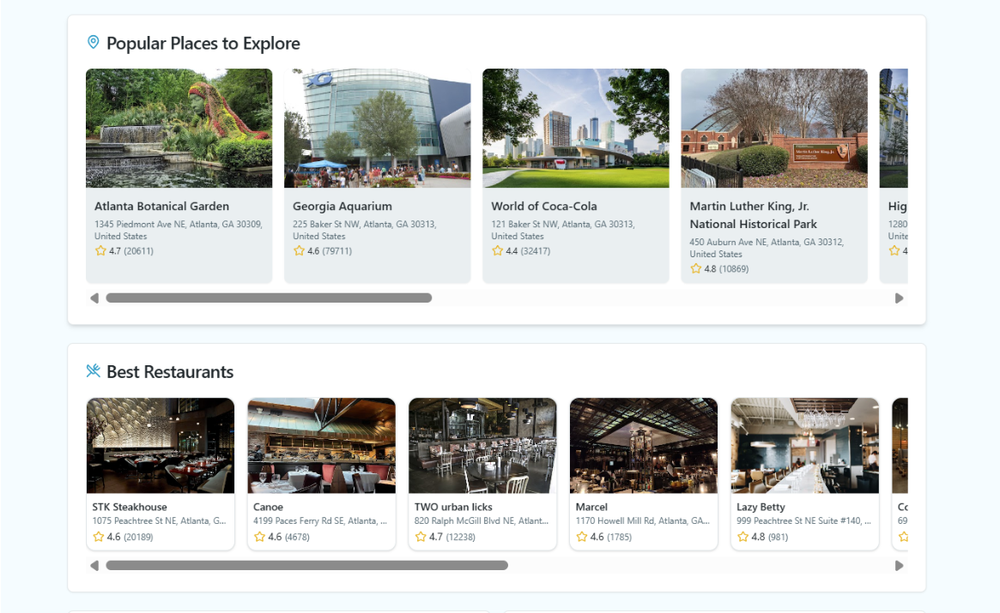
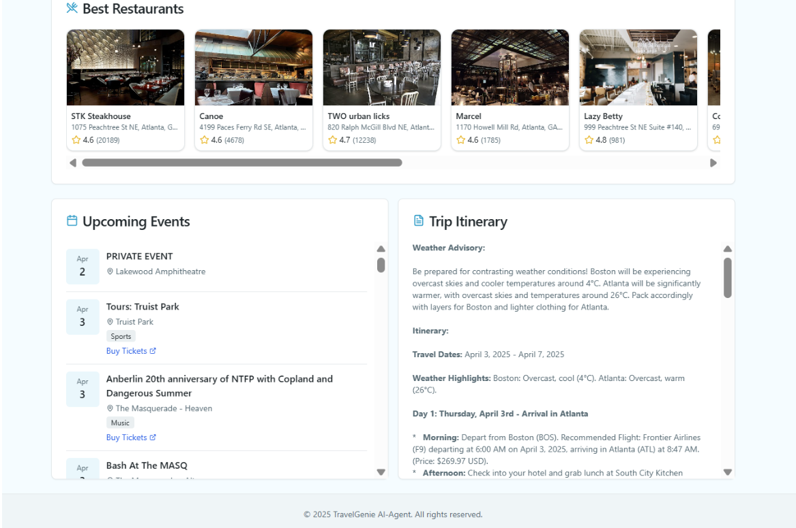

---

# 🌍 WanderMind – AI-Powered Multi-Agent Travel Planner

**WanderMind** is an intelligent travel assistant that uses multiple AI agents to design smart, real-time itineraries through a conversational interface. It interprets user input, consults specialized agents, and presents a dynamic dashboard of trip suggestions.

---

## 🧠 Inspiration

Most travel planning tools deliver static, overwhelming responses that lack personalization or live context. WanderMind was created to make trip planning feel like chatting with a personal assistant—interactive, informed, and intuitive.

---

## ✨ What It Does

* Accepts natural language input (e.g., “Plan a trip from LA to Seattle this weekend”)
* Parses user intent and extracts relevant trip data
* Coordinates specialized agents to retrieve:

  * 🗺️ **Routes & Transport**
  * 🌦️ **Weather Forecasts**
  * ✈️ **Flight Options**
  * 📍 **Attractions**
  * 🍽️ **Restaurants**
  * 🎟️ **Local Events**
* Outputs a beautifully styled dashboard with visual cards and summaries
* Uses Gemini 2.0 Flash + LangChain for orchestration and planning

---

## 🏗️ Architecture Overview

```
User Input → Supervisor Agent (Intent + Context)
           ↓
   Core Planner (LLM + LangChain)
           ↓
   Multiple AI Agents → External APIs
           ↓
     Dashboard → Visual UI Output
```

---

## ⚙️ How It’s Built

* **Frontend:** React + Tailwind CSS
* **Backend:** FastAPI
* **Orchestration:** LangChain + Gemini 2.0 Flash
* **Agents (Modular AI Units):**

  * Weather
  * Flights
  * Events
  * Attractions
  * Restaurants
  * Routing
* **APIs Integrated:**

  * Google Maps, Google Places
  * Amadeus (flights)
  * Ticketmaster (events)
  * OpenWeatherMap

---

## 🧩 Key Challenges

* Syncing multi-agent message flow
* Real-time data validation (e.g., invalid city pairs or date formats)
* Handling LLM reasoning across diverse data types
* Seamless frontend transition from chat → visual itinerary

---

## ✅ Accomplishments

* Built and deployed 6+ independent AI agents
* Designed a UI that feels like a chat-to-dashboard transformation
* Modular code that allows future expansion (e.g., budgeting, hotels, co-planning)

---

## 📚 What We Learned

* How to structure systems with autonomous AI agents
* Deepened skills in LLM orchestration using LangChain ReAct
* Best practices for secure and reliable multi-API integration
* Importance of UX in complex AI systems

---

## 🚀 What’s Next

* ✨ Voice-based input
* 🏨 Hotel booking agent
* 💸 Budget estimation and tracker
* 👥 Shared planning with friends
* 📱 Mobile app version
* 🗂️ Itinerary history and login-based access

---

---

## 🖼️ Screenshots

<p align="center">
  
</p>

<p align="center">
  
</p>

<p align="center">
  
</p>

<p align="center">
  
</p>

---

## 📈 Tech Stack

* **Frontend:** React, TailwindCSS, TypeScript
* **Backend:** FastAPI (Python)
* **AI/LLM:** Gemini 2.0 Flash, LangChain (ReAct)
* **Agents:** Modular agent architecture
* **APIs:** Google Maps, OpenWeather, Amadeus, Ticketmaster
* **Deployment:** Vercel (frontend), Render (backend)

---

## 📬 Contact

* GitHub: [@SecretariatV](https://github.com/SecretariatV)
* Email: [oliver.b25.f@gmail.com](mailto:oliver.b25.f@gmail.com)
* Telegram: [@ares\_orb](https://t.me/ares_orb)
* Twitter (X): [@OVB\_Coder](https://x.com/OVB_Coder)

